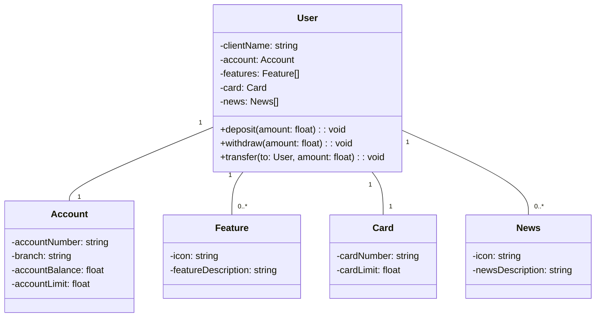

# DIO Santander Bootcamp
RESTful API using spring boot.

# DIO Spring RESTful API

## Overview
This project is a RESTful API built using Spring Boot, designed to demonstrate the implementation of CRUD operations and REST principles. It serves as a learning resource for Java developers interested in building scalable and maintainable APIs.

## API Endpoints
The API provides the following endpoints:
- **GET /api/resource**: Fetch all resources.
- **GET /api/resource/{id}**: Fetch a specific resource by ID.
- **POST /api/resource**: Create a new resource.
- **PUT /api/resource/{id}**: Update an existing resource by ID.
- **DELETE /api/resource/{id}**: Delete a resource by ID.

## Project Dependencies
The project utilizes the following dependencies:
- **Spring Boot**: Framework for building Java-based applications.
- **Spring Web**: Module for creating web applications and RESTful services.
- **Spring Data JPA**: Simplifies database access and ORM.
- **MySQL Driver**: Connects the application to a MySQL database.
- **Spring DevTools**: Enhances development experience with live reloads.

## Architecture
The project follows a layered architecture:
1. **Controller Layer**: Handles HTTP requests and responses.
2. **Service Layer**: Contains business logic.
3. **Repository Layer**: Manages database interactions using JPA.
4. **Entity Layer**: Represents the data model.

## Classes Diagram

## About the Author
This project was developed by **Wglastonio**, a passionate Java developer with expertise in building robust and efficient applications. You can find more of their work on [GitHub](https://github.com/wglastonio).

