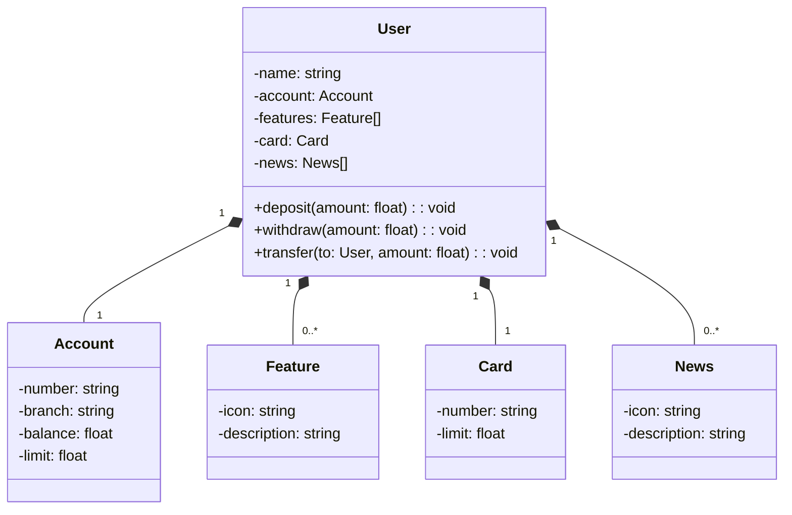

# DIO Santander Bootcamp
RESTful API using springboot

## Classes Diagram

```mermaid
classDiagram
    class User {
        -name: string
        -account: Account
        -features: Feature[]
        -card: Card
        -news: News[]

        +deposit(amount: float): void
        +withdraw(amount: float): void
        +transfer(to: User, amount: float): void
    }

    class Account {
        -number: string
        -branch: string
        -balance: float
        -limit: float
    }

    class Feature {
        -icon: string
        -description: string
    }

    class Card {
        -number: string
        -limit: float
    }

    class News {
        -icon: string
        -description: string
    }

    User "1" *-- "1" Account
    User "1" *-- "0..*" Feature
    User "1" *-- "1" Card
    User "1" *-- "0..*" News

```
