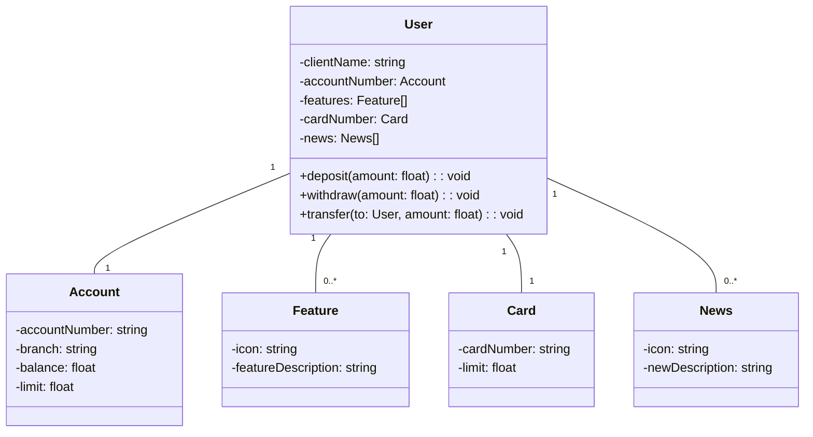

# DIO Santander Bootcamp
RESTful API using spring boot.

## Classes Diagram

```mermaid
classDiagram
    class User {
        -clientName: string
        -accountNumber: Account
        -features: Feature[]
        -cardNumber: Card
        -news: News[]

        +deposit(amount: float): void
        +withdraw(amount: float): void
        +transfer(to: User, amount: float): void
    }

    class Account {
        -accountNumber: string
        -branch: string
        -balance: float
        -limit: float
    }

    class Feature {
        -icon: string
        -featureDescription: string
    }

    class Card {
        -cardNumber: string
        -limit: float
    }

    class News {
        -icon: string
        -newDescription: string
    }

    User "1" -- "1" Account
    User "1" -- "0..*" Feature
    User "1" -- "1" Card
    User "1" -- "0..*" News
```
